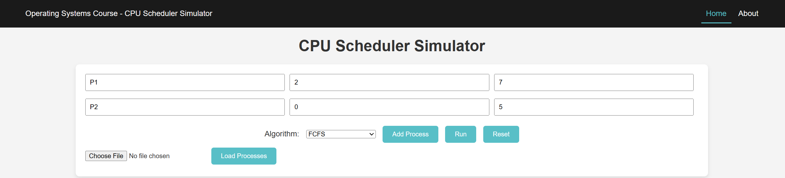
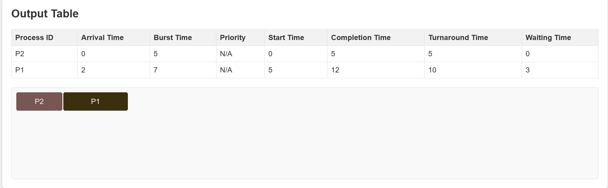
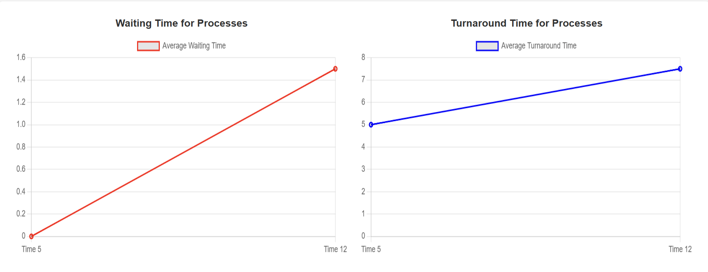
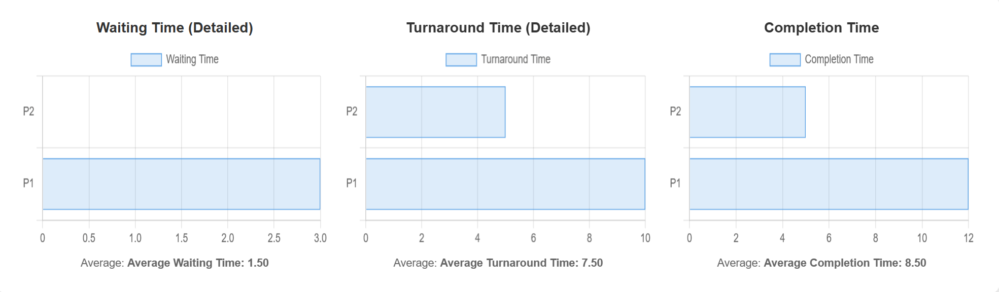

# CPU Scheduler Simulation

## Table of Contents
1. [Overview](#overview)
2. [Interface Customization Options](#interface-customization-options)
   - [Process Management](#process-management)
   - [Customizing Simulation Parameters](#customizing-simulation-parameters)
     - [Number of Processes](#number-of-processes)
     - [Time Ranges](#time-ranges)
     - [Selection of Scheduling Algorithms](#selection-of-scheduling-algorithms)
3. [Important Assumptions and Design Choices](#important-assumptions-and-design-choices)
4. [The Project Folder Structure](#the-project-folder-structure)
     - [Frontend](#frontend)
     - [Backend](#backend)
5. [Implementation Details](#implementation-details)
   - [Process Implementation](#process-implementation)
6. [Running the Project](#running-the-project)
7. [Algorithm Testing and Performance Metrics](#algorithm-testing-and-performance-metrics)
    - [Testing from the GUI](#testing-from-the-gui)
    - [Results and Metrics](#results-and-metrics)
    - [Testing in the Console](#testing-in-the-console)
      - [Interactive Testing (test.js)](#interactive-testing-testjs)
      - [Automated Testing (test2.js)](#automated-testing-test2js)
8. [Customization Options](#customization-options)
9. [Conclusion](#conclusion)

## Overview
This project simulates various CPU scheduling algorithms to analyze their performance in managing system resources. Initially started in Python, the project was transitioned to JavaScript to leverage specific libraries and frameworks for better interactive visualizations and performance analysis.

## Interface Customization Options

The simulation's graphical interface provides a user-friendly environment for customizing various parameters of the CPU scheduling algorithms. This section describes how users can interact with the interface to tailor the simulation to their specific requirements.

### Process Management

Users have the flexibility to dynamically add or remove processes during the simulation setup. For each process, critical attributes such as Arrival Time and Burst Time must be specified. Additionally, for scheduling algorithms that utilize priorities, users can assign a priority level to each process. This feature is particularly useful when comparing the performance of priority-based algorithms.

### Customizing Simulation Parameters

#### Number of Processes
The interface allows users to specify the number of processes they wish to simulate. This can be adjusted to test the scalability and efficiency of different scheduling algorithms under varying loads.

#### Time Ranges
Users can set the ranges for Arrival Times and Burst Times, providing control over the distribution and intensity of process demands. This flexibility helps in creating more realistic scenarios that can mimic actual operating conditions.

#### Selection of Scheduling Algorithms
The graphical interface includes a dropdown menu from which users can select the desired scheduling algorithm. Options include but are not limited to First Come First Served (FCFS), Shortest Job Next (SJN), and Priority Scheduling. This selection can be changed at any time before starting the simulation to explore different algorithms' behaviors.

These customization options empower users to modify the simulation environment extensively, allowing for a detailed analysis of various scheduling strategies under controlled yet diverse conditions.

## Important Assumptions and Design Choices

> :warning: The following assumptions have been made in the design and implementation of this simulation:

- **Priority Handling**: The simulation treats priorities in **ascending order**. Specifically, a **priority of 1** is considered the highest, significantly more critical than **priority 2**, and so forth. Lower numerical values represent higher priority levels.

- **Context Switch Considerations**: **Context switches** are assumed to be **instantaneous** in this simulation. This means the transition between processes is treated as **atomic**—the associated time cost is considered negligible and does not influence the performance evaluations or metrics.

These assumptions are pivotal for interpreting the simulation results and understanding the algorithm's behavior under these conditions.


### The Project Folder Structure

The project contains two main subfolders: `frontend` and `backend`, structured as follows:

#### Frontend
Located in the `frontend` folder, the frontend codebase uses HTML, CSS, and Vanilla JavaScript to provide an interactive web interface. This interface supports visualizing the scheduling processes through dynamically created tables and Gantt charts. Key files include:
- **HTML files**: `index.html` file that contains the project main GUI, and a small `about.html` for a brief presentation of the authors [Mohieddine Farid ](https://github.com/MohiZzine) and [Ayman Youss](https://github.com/AymanYouss/).
- **CSS files**: Style the application to improve usability and aesthetics.
- **JavaScript files**: Handle the logic for rendering the process table and Gantt charts based on the simulation data processed by the backend.

#### Backend
The `backend` folder contains the `server.js` file, which sets up and manages the backend server. This server processes requests related to the CPU scheduling simulation. Additionally, the `scheduling` sub-folder within `backend` contains several important components:
- **`Process.js`**: Defines the `Process` class used throughout the simulations.
- **Scheduling Algorithms**: Each scheduling algorithm is implemented in its own file within the `scheduling` sub-folder. The file names are self-explanatory, indicating the specific algorithm implemented within.

## Implementation Details

### Process Implementation

Below is a snippet from the `Process.js` file showing how processes are implemented in the simulation:

```javascript
class Process {
  constructor(pid, arrivalTime, burstTime, priority = null) {
      this.pid = pid;
      this.arrivalTime = arrivalTime;
      this.burstTime = burstTime;
      this.priority = priority;
      this.remainingBurstTime = burstTime;
      this.startTime = null;
      this.completionTime = null;
  }
}
```

This class handles the attributes and methods required to simulate a process in the CPU scheduler.

## Running the Project

To run the simulation:

1. Navigate to the '**backend**' directory with:

```bash
cd backend
node server.js
# This will start the backend server to handle the simulation
# You imperatively need Node.js installed to run this last command!
```

Ensure that you have [Node.js](https://nodejs.org/en/download) installed on your computer and configured in your "Environment Variables".

## Algorithm Testing and Performance Metrics

### Testing from the GUI

Testing each scheduling algorithm and analyzing performance metrics is a critical part of this simulation project. To test an algorithm, follow these steps:

1. Enter the Arrival Time and Burst Time for each process into the appropriate input fields on the website's interface.
2. Select the desired scheduling algorithm from the dropdown menu, such as "First Come First Served" (FCFS).
3. Click on the 'Run' button to start the simulation.



### Results and Metrics:
After running the simulation, the following results are displayed:

- **Output Table**: Lists all process information, including Process ID, Arrival Time, Burst Time, Priority (if applicable), Start Time, Completion Time, Turnaround Time, and Waiting Time.

- **Gantt Chart**: Provides a visual representation of the process execution order.

Scrolling down the page reveals additional visual insights:


- **Average Waiting and Turnaround Time Graphs**: Plots that display the waiting time and turnaround time for the processes, which helps in understanding the efficiency of the algorithm.



- **Detailed Metrics Charts**: Further down, you will find bar charts detailing the Waiting Time, Turnaround Time, and Completion Time for each process.



These visual tools not only aid in verifying the correctness of the algorithm's implementation but also provide an immediate comparative analysis of the various performance metrics.

### Testing in the Console

For console-based testing, the simulation provides two distinct testing options via scripts located in the `backend` directory. These options allow you to test scheduling algorithms either interactively or automatically using predefined data.

#### Interactive Testing (test.js)

1. **Running the Test**: Navigate to the `backend` directory and execute `node test.js` in the terminal.
2. **Algorithm Selection**: You will be prompted to select a scheduling algorithm from the list, such as "Shortest Job Next" or "Priority Scheduling".
3. **Process Definition**: Define the processes by entering their attributes (Process ID, Arrival Time, Burst Time, and Priority, if applicable) as prompted in the console.
4. **Results Display**: After running the simulation, the console will display detailed information for each process, including Process ID, Start Time, Completion Time, Turnaround Time, and Waiting Time. Additionally, average turnaround and waiting times for the entire batch of processes will be presented.

#### Automated Testing (test2.js)

1. **Running the Test**: Execute `node test2.js` from within the `backend` directory.
2. **Data Utilization**: This script automatically retrieves process data from the `test.json` file located in the same directory. 
3. **Algorithm Execution**: `test2.js` will run all available scheduling algorithms on the predefined set of processes.
4. **Results Compilation**: After processing, the script will output the results for each algorithm, displaying detailed metrics such as Turnaround Time, Waiting Time, and Completion Time for each process, alongside overall performance comparisons.

These console-based testing options provide a comprehensive assessment of each scheduling algorithm's performance, offering insights into their efficiency and effectiveness in various scenarios.

## Conclusion
This project provides a practical look at different CPU scheduling algorithms, highlighting their efficiency and impact on process management in a simulated environment. The interactive visualizations aid in understanding the complex dynamics of CPU scheduling.