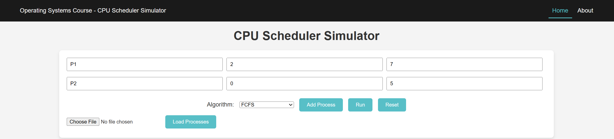
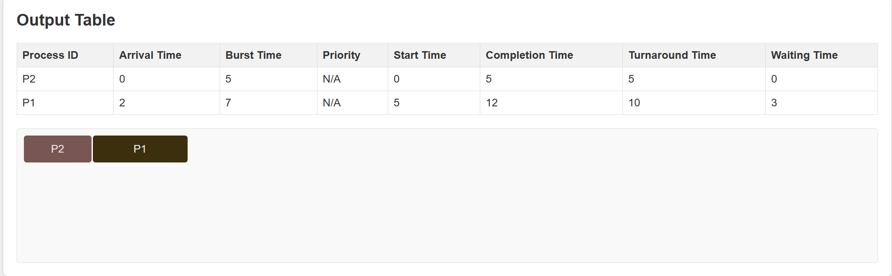
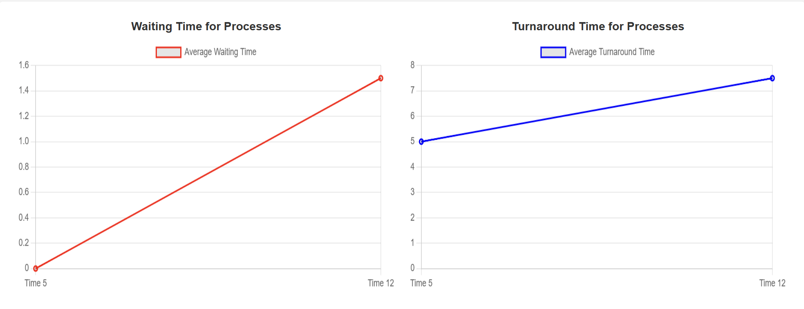
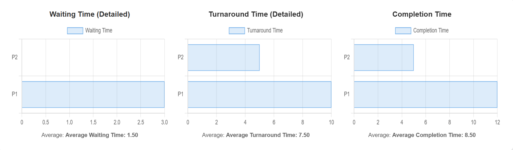

# CPU Scheduler Simulation

## Table of Contents
1. [Overview](#overview)
2. [Project Structure](#project-structure)
   - [JavaScript Folder Structure](#javascript-folder-structure)
     - [Frontend](#frontend)
     - [Backend](#backend)
3. [Implementation Details](#implementation-details)
   - [Process Implementation](#process-implementation)
4. [Running the Project](#running-the-project)
5. [Algorithm Testing and Performance Metrics](#algorithm-testing-and-performance-metrics)
6. [Customization Options](#customization-options)
7. [Testing and Examples](#testing-and-examples)
8. [Conclusion](#conclusion)

## Overview
This project simulates various CPU scheduling algorithms to analyze their performance in managing system resources. Initially started in Python, the project was transitioned to JavaScript to leverage specific libraries and frameworks for better interactive visualizations and performance analysis.

## Project Structure

The entire project is organized within the `Javascript` folder. Any Python files present are remnants from the initial phase of the project and are not part of the final implementation.

### JavaScript Folder Structure

The `Javascript` folder contains two main subfolders: `frontend` and `backend`, structured as follows:

#### Frontend
Located in the `frontend` folder, the frontend codebase uses HTML, CSS, and Vanilla JavaScript to provide an interactive web interface. This interface supports visualizing the scheduling processes through dynamically created tables and Gantt charts. Key files include:
- **HTML files**: Define the structure of the web application.
- **CSS files**: Style the application to improve usability and aesthetics.
- **JavaScript files**: Handle the logic for rendering tables and Gantt charts based on the simulation data processed by the backend.

#### Backend
The `backend` folder contains the `server.js` file, which sets up and manages the backend server. This server processes requests related to the CPU scheduling simulation. Additionally, the `scheduling` sub-folder within `backend` contains several important components:
- **`Process.js`**: Defines the `Process` class used throughout the simulations.
- **Scheduling Algorithms**: Each scheduling algorithm is implemented in its own file within the `scheduling` sub-folder. The file names are self-explanatory, indicating the specific algorithm implemented within.

## Implementation Details

### Process Implementation

Below is a snippet from the `Process.js` file showing how processes are implemented in the simulation:

```javascript
class Process {
  constructor(pid, arrivalTime, burstTime, priority = null) {
      this.pid = pid;
      this.arrivalTime = arrivalTime;
      this.burstTime = burstTime;
      this.priority = priority;
      this.remainingBurstTime = burstTime;
      this.startTime = null;
      this.completionTime = null;
  }
}
```

This class handles the attributes and methods required to simulate a process in the CPU scheduler.

## Running the Project

To run the simulation:

1. Navigate to the '**backend**' directory inside the '**Javascript**' directory with:

```bash
cd Javascript/backend
node server.js
# This will start the backend server to handle the simulation
# You imperatively need Node.js installed to run this last command!
```

Ensure that you have [Node.js](https://nodejs.org/en/download) installed on your computer and configured in your "Environment Variables".

## Algorithm Testing and Performance Metrics

Testing each scheduling algorithm and analyzing performance metrics is a critical part of this simulation project. To test an algorithm, follow these steps:

### Testing Steps:
1. Enter the Arrival Time and Burst Time for each process into the appropriate input fields on the website's interface.
2. Select the desired scheduling algorithm from the dropdown menu, such as "First Come First Served" (FCFS).
3. Click on the 'Run' button to start the simulation.


### Results and Metrics:
After running the simulation, the following results are displayed:

- **Output Table**: Lists all process information, including Process ID, Arrival Time, Burst Time, Priority (if applicable), Start Time, Completion Time, Turnaround Time, and Waiting Time.

- **Gantt Chart**: Provides a visual representation of the process execution order.

Scrolling down the page reveals additional visual insights:


- **Average Waiting and Turnaround Time Graphs**: Plots that display the waiting time and turnaround time for the processes, which helps in understanding the efficiency of the algorithm.



- **Detailed Metrics Charts**: Further down, you will find bar charts detailing the Waiting Time, Turnaround Time, and Completion Time for each process.



These visual tools not only aid in verifying the correctness of the algorithm's implementation but also provide an immediate comparative analysis of the various performance metrics.


## Customization Options

Describe how users can customize the simulation, including choosing the number of processes, setting burst and arrival time ranges, and selecting scheduling algorithms.

## Testing and Examples

Provide examples of test cases and input data used to validate the correctness of the scheduling algorithms. Include screenshots or logs that demonstrate the test results.

## Conclusion

This project provides a practical look at different CPU scheduling algorithms, highlighting their efficiency and impact on process management in a simulated environment. The interactive visualizations aid in understanding the complex dynamics of CPU scheduling.